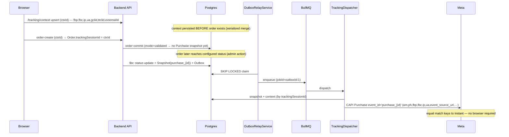
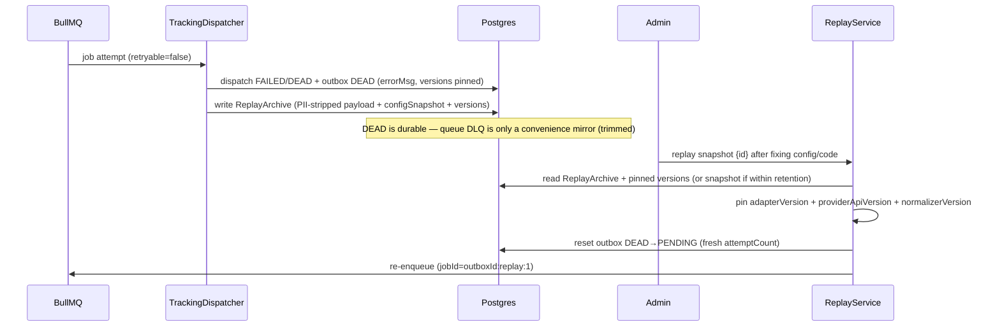

# EcoMate Meta Conversions API — Enterprise Tracking Redesign

**Status:** Approved design, v2 (audit-hardened, pre-implementation)
**Date:** 2026-08-02
**Scope:** Backend (NestJS), Storefront (Next.js), Admin (React) — tracking pipeline only
**Approach:** Transactional Outbox + Canonical Snapshot + Provider Adapter pipeline

---

## 1. Overview

EcoMate currently fires marketing events to Meta, TikTok, GA4, and Google Ads through duplicated per-provider services with a fire-and-forget queue, no durable event log, and a Purchase double-count risk. This redesign replaces that with an **enterprise-grade, provider-agnostic tracking pipeline** built on four principles:

1. **The database is the source of truth.** Every business-critical event (Purchase, Refund, Lead) is captured as a canonical **snapshot** plus an **outbox** row *inside the same database transaction* as the business operation, using an **idempotent insert that can never fail the business transaction**. BullMQ is only a delivery mechanism — a queue/Redis outage never loses an event.
2. **One canonical event, many providers.** The snapshot is a provider-agnostic business record (no hashed values, no provider field names). Provider-specific payloads are generated only by the **Dispatcher/Adapter layer**.
3. **Delayed events keep instant quality.** Browser context (`fbp`, `fbc`, `gclid`, `ttclid`, IP, UA, `external_id`) is captured *before* order creation and linked to the order, so a Purchase fired later at a configured order status has the same match keys as one fired at checkout.
4. **Everything is traceable and recoverable.** Every dispatch records correlation ids (`snapshotId`, `eventId`, `provider`, `orderId`, `ctxId`, `queueJobId`), adapter/provider/normalizer versions, and every state transition; retries, dead-letter, reconciliation, idempotency, retention, anonymization, and replay are first-class parts of the design.

### Goals
- Single authoritative Purchase per order, dispatch timing configurable (instant vs. order-status "validated"), with no loss of Meta match keys or event quality in either mode.
- Provider-agnostic pipeline: adding Pinterest or any future provider requires only a new Adapter — no pipeline change.
- Hashing/normalization in exactly one shared abstraction.
- Full observability for a future Admin dashboard without an external metrics stack.

### Non-goals (out of scope for this design)
- Implementing the Admin monitoring dashboard UI in this phase (data model + KPIs are designed here; the page is built later).
- Redesigning GA4 / Google Ads / TikTok *semantics* — they are consumers of the same pipeline, but their own API requirements (e.g. GA4 `client_id`) are satisfied inside their adapters.
- Offline/POS `physical_store` dispatch flows beyond what already exists; the pipeline supports them, but web is the primary path.

---

## 2. Current Architecture (baseline)

```
Browser (storefront)
  tracking.ts  → fbq('track', E, data, {eventID})   // random eventID per event
               → POST /tracking/events (same eventId mirror)
  thank-you    → trackEvent('Purchase', …)           // random eventID
               → POST /tracking/context (fbp/fbc, keyed by orderId) — saved too late
Backend (NestJS)
  orders.service  → firePurchaseInstant (order create) / firePurchaseValidated (status change)
                    → tracking.track({eventId: 'purchase_{id}'})  // .catch() fire-and-forget
  tracking.service → enqueue to BullMQ 'tracking'
  tracking-queue.processor → map names → Promise.allSettled(Meta, TikTok, GA4)
  meta-conversions.service  // own hashing + payload + retry
  tiktok-events.service     // own hashing + payload + retry (duplicated)
  ga4-measurement.service   // env-only, client_id='ecomate-server'
  google-ads.service        // conversion on Purchase
```

### Confirmed defects
| # | Defect | Evidence |
|---|---|---|
| D1 | **Purchase double-count in `instant` mode** — browser fires Purchase with a random `eventID`; server fires a second Purchase with `purchase_{orderId}`. Different dedup keys → Meta counts two purchases. | `tracking.ts` `generateEventId()`; `orders.service.ts:3082` |
| D2 | **Server Purchase/Refund send empty `client_ip_address`/`client_user_agent`** — both are required web-event fields and match keys. | `orders.service.ts:3091-3092`, `:3137-3138` |
| D3 | **Tracking context saved too late** — browser persists `fbp/fbc` on the thank-you page, *after* the server Purchase already read it (`getContext` at order placement), so the server event typically has no `fbp/fbc`. | `ThankYouContent.tsx:116` vs `orders.service.ts:3050` |
| D4 | **No stable `external_id`** — derived per-event from `userId`/phone; not shared with the Pixel (`fbq('init', id, {external_id})`). | `meta-conversions.service.ts:93-97`; `TrackingScripts.tsx:57` |
| D5 | **Hashing/normalization duplicated** across Meta, TikTok (and partially GA4) — a rule change requires N edits. | `meta-conversions.service.ts:207-231`; `tiktok-events.service.ts:208-231` |
| D6 | **No durable event log** — `TrackingEvent` rows are never updated to `sent/failed/deduped` by the processor; failures are log-only. | `tracking-queue.processor.ts` |
| D7 | **No queue-level retry** — BullMQ job uses default `attempts`; outbox/durable retry does not exist. | `tracking-queue.service.ts:23-26` |
| D8 | **`zp` not normalized** (no dash/space strip, US first-5); non-BD phone country codes dropped. | `meta-conversions.service.ts:207-231` |
| D9 | **Coverage gaps** — `AddPaymentInfo`, `Search`, `CompleteRegistration` never fire at all (neither Pixel nor CAPI). (`PageView` fires via Pixel + analytics only — acceptable; CAPI PageView is excluded by design.) | storefront grep |
| D10 | **`test_event_code` unguarded** — applied whenever the setting exists, even in production. | `meta-conversions.service.ts:131-133` |

---

## 3. Target Architecture

### 3.1 Principles
- **Queue = delivery mechanism; DB (outbox) = source of truth.** The dispatcher reads *only* the outbox.
- **Canonical snapshot is the single business record**; providers are projections of it.
- **Provider independence**: one provider failing never blocks others; each provider's state is tracked independently, and a repair never re-sends an already-successful provider.
- **Capture never breaks business.** Snapshot/outbox insert is idempotent (`ON CONFLICT DO NOTHING`); a duplicate or constraint violation can never roll back an order/refund/status-change transaction.
- **Write-once context**: static identifiers are first-seen-wins; rotating identifiers refresh but are never cleared; all merges are serialized per `ctxId`.

### 3.2 Component diagram

```
┌──────────── Browser (storefront) ─────────────┐      ┌────────────────── backend ──────────────────┐
│ TrackingClient                               │      │                                              │
│ • ctxId (localStorage, stable per journey)   │      │ Business layer (orders, refunds, leads)      │
│ • reads _fbp/_fbc/_ga/gclid/ttclid + URL     │      │  ┌─────────────────────────────────────────┐  │
│ • fbq('track', E, {eventID})                 │      │  │ prisma.$transaction:                    │  │
│ • POST /tracking/context (upsert ctxId)      │─────▶│  │  business mutation                      │  │
│ • POST /tracking/events (mirror, same id)    │─────▶│  │  + Snapshot (ON CONFLICT DO NOTHING)    │  │
│ • order-create carries ctxId                 │─────▶│  │  + Outbox insert                        │  │
└──────────────────────────────────────────────┘      │  └─────────────────────────────────────────┘  │
                                                     │              │                                  │
                                                     │              ▼                                  │
                                                     │  OutboxRelayService (SKIP LOCKED claim)         │
                                                     │              │                                  │
                                                     │              ▼                                  │
                                                     │  BullMQ 'tracking' (delivery only, per-attempt  │
                                                     │   job ids, priority for Purchase/Refund)        │
                                                     │              │                                  │
                                                     │              ▼                                  │
                                                     │  TrackingDispatcher                            │
                                                     │   snapshot + context ──▶ Adapter registry       │
                                                     │   (Meta/TikTok/GA4/GoogleAds/…)                │
                                                     │   work set = non-terminal dispatch rows only   │
                                                     │   └─ TrackingNormalizer (SHA-256, one place)   │
                                                     │   └─ TrackingDispatch (per-provider state)     │
                                                     │   └─ TrackingDispatchEvent (transition log)    │
                                                     │  DLQ ──▶ ReconcilerService ──▶ re-enqueue      │
                                                     │  ReplayService (version-pinned re-dispatch)    │
                                                     │  ReplayArchive (long-lived, PII-stripped)      │
                                                     └───────────────────────────────────────────────┘
```

---

## 4. Core Components

### 4.1 TrackingContext (browser session context — provider-agnostic)

Captures everything needed to match a user across providers, independent of any single provider.

| Field | Type | Notes |
|---|---|---|
| `id` | uuid | PK |
| `ctxId` | string, unique | Stable journey id generated by the browser (`localStorage`), passed on every tracking call and on order-create |
| `externalId` | string | **Stable match id keyed to the authenticated customer** (`customerId`, or normalized email/phone hash) when available; a per-journey uuid fallback for guests. Never regenerated for the same customer. |
| `ip` / `userAgent` | string | Added by the backend from the request (never trusted from the browser) |
| `url` / `referrer` | string | Page context at last observation |
| `identifiers` | Json | Provider-namespaced raw identifiers with **per-key provenance**: `{"meta":{"fbp":{"value":"…","firstSeenAt":…,"lastSeenAt":…}},"tiktok":{"ttclid":{…}},"google":{"gaClientId":{…},"gclid":{…}},"pinterest":{…}}` |
| `firstSeenAt` / `lastSeenAt` | timestamp | Row-level provenance |
| `createdAt` / `updatedAt` | timestamp | |

**Provider-agnostic design:** a new provider needs **no schema change** — it is just new keys under `identifiers`. The backend stores whatever cookie/URL identifiers the browser observes; providers are namespaces, not columns.

**Enrichment rules (incremental, serialized):**
- Updates are **serialized per `ctxId`** — a transaction does `SELECT … FOR UPDATE` on the row, then merges, then writes (or one atomic `INSERT … ON CONFLICT (ctxId) DO UPDATE` with jsonb merge + per-key `lastSeenAt` compare-and-set). A whole-object blob derived from one request's observation is never written, so concurrent POSTs (multi-tab) cannot lose each other's fields.
- **Static identifiers** (`externalId`, email, phone): **first non-empty value wins**; later requests fill only missing fields, never overwrite.
- **Rotating identifiers** (`fbp`, `fbc`, `gclid`, `ttclid`, `_ga`): replace when a **newer valid value** arrives (compare `lastSeenAt`); **never clear to null** — a cookie-loss page load must not destroy the value a delayed event depends on.
- Per-key `firstSeenAt`/`lastSeenAt` give provenance for the dashboard and for the "replace when newer" rule.

**Order linkage:** `Order.trackingSessionId = ctxId` (set at order creation from the incoming `ctxId`). The dispatcher resolves context via snapshot → `ctxId`. This is the mechanism that makes **delayed Purchase quality identical to instant**.

### 4.2 TrackingSnapshot (canonical business event)

The immutable, provider-agnostic record of *what happened*. **Never** contains provider payloads, hashed values, or provider-specific parameter names.

| Field | Type | Notes |
|---|---|---|
| `id` | uuid | PK |
| `eventId` | string, unique | Dedup key: `purchase_{orderId}` / `refund_{orderId}` / `lead_{id}` / journey-stable key for browser events |
| `eventType` | string | `Purchase`, `Refund`, `AddToCart`, `InitiateCheckout`, `AddPaymentInfo`, `ViewContent`, `Search`, `CompleteRegistration`, `Lead`. (`PageView` is **reserved, never captured** — Pixel + analytics only, §5.) |
| `orderId` / `ctxId` | string? | Linkage for dispatch + dashboard |
| `eventTime` | **BigInt** | Unix seconds at business time (order createdAt / status-change time) — never dispatch time. `BigInt` avoids PostgreSQL `INTEGER` 2038 overflow. |
| `actionSource` | string | `website` / `physical_store` / … |
| `schemaVersion` | int | Canonical payload schema version; bump only on breaking shape changes |
| `payload` | Json | Canonical business data: order totals, items (`id`, `quantity`, `item_price`), customer (email, phone, names — **raw, unhashed**), etc. |
| `createdAt` | timestamp | |

Hashing happens **only** in the adapter/normalizer path, never at capture.

### 4.3 TrackingOutbox (source of truth)

| Field | Type | Notes |
|---|---|---|
| `id` | uuid | PK |
| `snapshotId` | string, unique | One outbox row per snapshot |
| `configSnapshot` | Json | Tracking config active at business time: enabled providers, purchase mode, validated status, success policy, normalizer version |
| `status` | enum | `PENDING` ⇄ `CLAIMED` → `SENT` \| `FAILED` → `DEAD` (see §7.1 for all edges) |
| `attemptCount` | int | Durable retry counter |
| `nextAttemptAt` | timestamp | Backoff schedule (outbox-owned; the only retry scheduler) |
| `lockedAt` / `lockedBy` | timestamp / string | Relay claim guard — **always cleared on every release/reset** |
| `lastError` | string? | For dashboard |
| `createdAt` / `publishedAt` / `dispatchedAt` | timestamp | |

**Claim query (raw SQL — Prisma `updateMany` cannot return rows):**
```sql
UPDATE "TrackingOutbox" SET status='CLAIMED', "lockedAt"=now(), "lockedBy"=$1
WHERE id IN (
  SELECT id FROM "TrackingOutbox"
  WHERE status='PENDING' AND "nextAttemptAt"<=now() AND "lockedAt" IS NULL
  ORDER BY priority DESC, "nextAttemptAt" ASC
  LIMIT $2 FOR UPDATE SKIP LOCKED
)
RETURNING id, "snapshotId"
```
`SKIP LOCKED` makes **multiple relay instances safe** (no double-claim). `priority` prefers Purchase/Refund over high-volume browser events.

### 4.4 TrackingDispatch + TrackingDispatchEvent (per-provider state + observability)

**TrackingDispatch** — exactly one row per (snapshot, provider); idempotency guard.

| Field | Type | Notes |
|---|---|---|
| `id` | uuid | PK |
| `snapshotId` | string | Trace root; the correlation id throughout |
| `eventId` / `orderId` / `ctxId` | string | `eventId` is **non-null** (every snapshot has one); `orderId`/`ctxId` nullable — denormalized from snapshot for observability |
| `provider` | string | `meta` / `tiktok` / `ga4` / `google_ads` / … |
| `status` | enum | `PENDING` → `SENDING` → `SENT` \| `RETRY` → `SENT` \| `FAILED` → `DEAD`, plus `DEDUPED`, `SKIPPED` |
| `providerEventId` | string? | Provider-side dedup id (Meta `event_id`, TikTok `event_id`) — same value on every retry |
| `httpStatus` / `responseBody` / `errorMsg` | int / string? | Sanitized (PII stripped/truncated) |
| `attemptCount` | int | |
| `adapterVersion` / `providerApiVersion` / `payloadVersion` | int? / string? | **Nullable — pinned only when a send occurs** (`SENT`/`RETRY`/`FAILED`); `null` for `SKIPPED`/`DEDUPED` rows where no adapter ran |
| `queueJobId` | string? | Actual BullMQ job id of the last attempt (`${outboxId}:${attemptCount}`) |
| `createdAt` / `updatedAt` | timestamp | |

`@@unique([snapshotId, provider])` — a retry **upserts** this row (`attemptCount++`), never creates a second row.

**TrackingDispatchEvent** — append-only transition log, the raw material for the Admin dashboard timeline: `snapshotId, eventId, orderId, ctxId, provider?, queueJobId?, fromStatus, toStatus, attempt, message?, createdAt`. Every outbox/dispatch state change (including capture-time `DEDUPED` and replay) appends a row.

### 4.5 TrackingNormalizer (single hashing/normalization abstraction)

One class, injected into every adapter. Owns all SHA-256 hashing and normalization, plus a `version` recorded in `configSnapshot` and pinned by replay:
`hashEmail`, `hashPhone(phone, country)`, `hashName`, `hashCity/State/Zip/Country`, `hashExternalId`, `isSyntheticEmail`, `splitName`, zip de-dash/US-first-5, gender/dob normalization.

- **Phone:** always yields E.164-with-country-code identical to browser-side Advanced Matching. Detect an existing country code; strip `+`; for a 10-digit BD local number restore the leading `0` before adding `880`; never emit a bare number without a country code.
- **Synthetic email filter** matches `cust_` prefixes, all-numeric local parts, **and `+`-tagged addresses** (`name+tag@example.com`) that Meta treats as invalid.
- Exposes both **raw-normalized** and **hashed** variants; adapters pick what their provider requires (e.g. GA4 takes `client_id` raw, Meta takes SHA-256 `em`).
- **No adapter implements hashing or normalization.** A provider rule change = edit one file.

### 4.6 TrackingProviderAdapter + registry

```ts
interface TrackingProviderAdapter {
  readonly provider: string;                 // 'meta' | 'tiktok' | 'ga4' | 'google_ads' | 'pinterest' | …
  readonly version: number;                  // adapterVersion
  readonly providerApiVersion: string;       // e.g. 'v22.0' (Meta), 'v1.3' (TikTok)
  supports(eventType: string): boolean;      // which snapshot types this provider consumes
  build(snapshot, ctx | null, normalizer): ProviderPayload | null;
  send(payload, cfg): Promise<DispatchResult>;
}
interface DispatchResult {
  ok: boolean;
  retryable: boolean;                        // 4xx → false; 5xx/429/timeout → true
  providerEventId?: string;
  httpStatus?: number;
  rawResponse?: string;
}
```

- The registry is a `Map<(provider, version), TrackingProviderAdapter>` populated at module bootstrap. **Old adapter versions stay registered (frozen)** so replay can pin the exact version that produced a historical payload; live dispatch always uses the latest.
- **`build` with `ctx = null`** (POS/admin orders, consent-blocked, lost context POST) is defined: adapters either produce an explicit **degraded payload** (snapshot's canonical customer fields only, no session identifiers) or return `null` → dispatch `SKIPPED` with a reason. It is a normal condition, never an error.
- **Dispatch policy per event type** (each adapter declares): e.g. the **GA4 adapter suppresses server Measurement-Protocol dispatch for event types the browser already fires via gtag in instant mode** (GA4 MP has no dedup — server+browser copies with the same `client_id` would double-count); MP is used only for validated/offline events with no browser counterpart. Meta/TikTok rely on `event_id` pass-through (dedup-capable).
- **Refund mapping (explicit, per provider):**
  | Provider | Refund mapping |
  |---|---|
  | Meta | CAPI `Purchase` with **negative `value`** (netted revenue) and a **distinct `event_id = refund_{orderId}`** so dedup never absorbs it |
  | Google Ads | Negative-value offline conversion (or skip) |
  | GA4 | `refund` event with `items` + `value` + `currency` |
  | TikTok | Defined equivalent (`CompletePayment` negative or skip) |
  Refunds are **excluded from instant-mode browser firing** (server-authoritative only).
- **Adding a provider = adding one Adapter class + one config block.** The pipeline, outbox, queue, retry, monitoring never change.

### 4.7 TrackingDispatcher

- Sole consumer of the outbox (via queue jobs). For each snapshot: load snapshot + linked `TrackingContext`, iterate the **enabled** providers from `configSnapshot`, and run each adapter **independently** (`Promise.allSettled`) — a Meta failure never blocks TikTok/GA4/Google Ads.
- **Work set = dispatch rows in a non-terminal state only** (`PENDING`/`SENDING`/`RETRY`). A retry or reconciler repair **never re-runs** an already-`SENT`/`DEAD`/`SKIPPED`/`DEDUPED` provider — this prevents double HTTP sends where the provider has no dedup key (GA4/Google Ads).
- Each provider advances its own `TrackingDispatch`; the outbox reaches terminal state by a **configurable success policy** in `configSnapshot`: `ALL_SENT` (default) / `ANY_SENT` / `N_SENT`. `SKIPPED`/`DEDUPED` count as satisfied.
- **Outbox terminal rules (no stuck rows):**
  - All eligible providers `SENT`/`SKIPPED`/`DEDUPED` → outbox `SENT`.
  - **Zero eligible providers** (none enabled, or none `supports(eventType)`) → outbox `SENT` (NOOP) so the row purges.
  - Any **required** provider permanently `DEAD` (4xx) under `ALL_SENT` → policy is impossible → outbox `FAILED → DEAD` deterministically (recorded as policy-impossible; already-`SENT` providers stay `SENT`).
  - Retryable failures: dispatcher transitions outbox `CLAIMED → PENDING`, sets `attemptCount++` + `nextAttemptAt` and **clears `lockedAt`/`lockedBy`** — the relay is the retry scheduler.
- **Payloads are ephemeral** — built in the send path, never persisted (only sanitized status/response is stored).

### 4.8 OutboxRelayService

- Interval poll (~1s): claim N `PENDING` rows via the **SKIP LOCKED raw-SQL claim** (§4.3), enqueue one BullMQ job per row.
- **Job id is unique per attempt:** `jobId = ${outboxId}:${attemptCount}` — never reuse a plain `outboxId`, because BullMQ treats a re-added id as a no-op while the completed/failed incarnation is retained. Store the actual job id in `TrackingDispatch.queueJobId`.
- **Priority:** claim orders by `priority` (Purchase/Refund first), keeping business-critical freshness under a browser-event flood. Freshness SLO is defined in §11.
- If enqueue fails, **release the lock** (status `PENDING`, `lockedAt=NULL`, `lockedBy=NULL`, `nextAttemptAt` set) → next poll retries. No event is lost while Redis is down.
- **Deployment:** multiple relay instances are safe (SKIP LOCKED). Dispatcher workers scale horizontally (stateless, BullMQ concurrency configured per instance).

### 4.9 ReconcilerService (self-healing)

Scheduled job that repairs stuck states deterministically. **Every reset/release clears `lockedAt`/`lockedBy` and sets `nextAttemptAt`** (otherwise the claim predicate permanently excludes the row):
- `PENDING` older than threshold → re-claim.
- `CLAIMED` with no dispatch progress > X min → reset to `PENDING`.
- `SENDING` dispatch hung > X min → mark retryable → retry (dispatcher work-set rule prevents re-sending SENT providers).

### 4.10 ReplayService + ReplayArchive

- **ReplayArchive** is a long-lived (2-year), **PII-stripped** copy written when a snapshot reaches terminal/`DEAD`: snapshot payload + `configSnapshot` + pinned `schemaVersion`/`adapterVersion`/`providerApiVersion`/`payloadVersion`/`normalizerVersion` + non-PII match keys (hashes only). This is what makes replay possible **after** §12 retention purges raw data — it reconciles the 2-year replay guarantee with the 90-day raw-PII bound.
- Replay reads the archive + registry, **pins the recorded adapter version** (falling back to current with an explicit version-mismatch warning), resets outbox `DEAD → PENDING` with a fresh `attemptCount`, and re-enqueues (job id carries the new attempt nonce).
- **Scope:** replay re-delivers to a live provider only for events whose `event_time` is within the provider's send window (Meta ≤ 7 days) **and** within the provider dedup window for browser-fired instant events (§9). Older events replay to an audit/export sink, not to live provider APIs.

### 4.11 TrackingSettingsService

Central config source: system_settings keys + env fallback (same pattern as today's `tracking_meta_*`). Keys: enabled flags, pixel ids/tokens, purchase mode, validated status, success policy, test-event codes, retention windows, claim batch size, dispatcher concurrency. Adapters receive their config through this service; values are snapshotted into `configSnapshot` at capture time.

- **Test-event codes are gated:** a `test_event_code` is honored only when the provider's explicit test-mode flag is set — a leftover value can never leak into production traffic (fixes D10).

### 4.12 TrackingClient (browser)

- On load: get-or-create `ctxId` (localStorage), read cookies `_fbp`, `_fbc`, `_ga`, `_ttp`, and URL params `fbclid`, `gclid`, `ttclid`; POST `/tracking/context` (upsert by `ctxId`, throttled to navigation + tracked events).
- Every `trackEvent`: fire the Pixel `fbq('track', E, data, {eventID})` **and** POST `/tracking/events` with the **same** `eventId` + `ctxId` (Pixel↔CAPI parity + provider dedup).
- Purchase: pass the **deterministic** `eventId = purchase_{orderId}` (from the order response) instead of a random id — fixes D1. In **validated** mode the browser does **not** fire a Purchase at all.
- Browser events use a **journey-stable logical-action key** (`{eventType}_{ctxId}_{productId}`) to reduce duplicates from double-click / StrictMode double-mount; `/tracking/events` also handles a residual `eventId` conflict as **deduped (HTTP 200)**, never an error.
- Order-create includes `ctxId` → backend sets `Order.trackingSessionId`.

---

## 5. Capture Paths

Two ways a snapshot enters the pipeline; both funnel to snapshot + outbox → dispatcher.

1. **Server-authoritative (transactional, for business-critical events):** `Purchase`, `Refund`, `Lead`. Written inside the **same `prisma.$transaction`** as the business mutation, using an **idempotent insert** (`INSERT … ON CONFLICT (eventId) DO NOTHING` / `createMany skipDuplicates`):
   - order creation → instant Purchase snapshot (or no snapshot if mode = validated)
   - order status change → validated Purchase snapshot (when status matches `validated_status` and **no Purchase snapshot exists for the order yet**) / Refund snapshot (cancelled/returned, distinct `refund_{orderId}`)
   - lead creation → Lead snapshot
   **A duplicate capture is detected, recorded as `DEDUPED` in `TrackingDispatchEvent`, and never fails the business mutation** (fixes the audit finding that a UNIQUE violation could roll back an order). At most one Purchase snapshot per order.
2. **Browser-originated (Pixel parity, for client events):** `AddToCart`, `InitiateCheckout`, `AddPaymentInfo`, `ViewContent`, `Search`, `CompleteRegistration`. The browser POSTs `/tracking/events`; the handler creates snapshot + outbox (its own transaction), returning **200/deduped** on an `eventId` conflict. **`PageView` is excluded from CAPI dispatch** (Pixel fires it; page-view analytics keep the existing buffer path) — it is not part of the parity set.

**Important:** `/tracking/events` is now a *capture* endpoint (writes snapshot+outbox), not a direct send. The dispatcher handles all delivery.

---

## 6. Dispatch Semantics — Single Authoritative Purchase

Per approved model, a Purchase business event exists **once** per order; only *timing* is configurable:

| Mode | Browser Pixel | Server CAPI | When |
|---|---|---|---|
| **Instant** (default) | Fires `fbq('track','Purchase',…,{eventID:'purchase_{orderId}'})` on thank-you | Captured transactionally at order create, dispatched ~seconds later, `event_id='purchase_{orderId}'` | Order placed |
| **Validated** | **No** Purchase dispatch | Captured transactionally when the order reaches the configured `validated_status` | Status change |

- **Instant:** Pixel + CAPI share `event_id` + `event_name` → Meta dedups **within 48h** (the 5-minute rule only selects *which copy* Meta uses when both arrive close together; the same key always dedups within 48h regardless of order). This fixes D1.
- **Validated:** no browser event; CAPI uses the **persisted context** (`fbp`, `fbc`, `ip`, `ua`, `external_id`, `event_source_url`, …) via `Order.trackingSessionId` → **equal match keys to instant** (fixes D2/D3/D4). Event quality no longer depends on whether the user's browser is still open.
- **Residual dedup edge (documented):** if an instant-mode CAPI send would land **more than 48h after the Pixel event** (prolonged outage, replay), Meta would no longer dedup. The dispatcher applies a **48h dedup-window guard** on instant-mode CAPI sends — a browser-confirmed Purchase whose CAPI dispatch time exceeds the window is marked `DEDUPED`/flagged rather than re-sent — and the dashboard tracks a residual-double-count KPI (§14).

---

## 7. Queue Lifecycle, Retry, DLQ, Idempotency, Reconciliation

### 7.1 State machines (monitoring-first)

**Outbox (event-level, source of truth):**
```
PENDING ⇄ CLAIMED ──► SENT            (success policy met, incl. zero-eligible NOOP)
        │        └──► FAILED ──► DEAD  (retries exhausted / policy-impossible)
        │   (retryable failure: dispatcher → PENDING, attemptCount++, nextAttemptAt, lock cleared)
        └────────── DEAD ──► PENDING   (ReplayService)
```

**TrackingDispatch (per-provider):**
```
PENDING ──► SENDING ──► SENT
                    └──► RETRY ──► SENDING ──► … ──► SENT | FAILED ──► DEAD
                        (SKIPPED)   (DEDUPED)        (SKIPPED/DEDUPED rows have null versions)
```
Every transition appends a `TrackingDispatchEvent`.

### 7.2 Retry (two layers, no conflict)
1. **Queue layer (transport):** BullMQ `attempts: 3`, exponential backoff `2000ms`. `removeOnComplete: 100`, `removeOnFail: 50`. Job id = `${outboxId}:${attemptCount}` (per-attempt unique, so a retained job never shadows a re-enqueue).
2. **Outbox layer (durable, outbox-owned):** `attemptCount` + `nextAttemptAt` with exponential backoff (1m → 10m → 1h → 6h → 24h; max 5 → `DEAD`). On a retryable failure the **dispatcher returns the outbox to `PENDING`** (clearing the lock) so the relay re-claims on schedule. Survives a full queue/Redis outage.
   - Adapter `retryable=true` (5xx / 429 / timeout / network) → retry.
   - Adapter `retryable=false` (4xx / validation) → permanent `FAILED`/`DEAD` with `errorMsg` — surfaced in monitoring as a code/config bug; no point re-sending a bad payload.
   - **Retries reuse the same `providerEventId`** so provider-side dedup absorbs duplicate sends.

### 7.3 Dead-letter
- Exhausted jobs mirror to a `tracking-dlq` BullMQ queue for ops visibility, but the **durable DEAD record is the DB** — the queue DLQ is a convenience, never the source of truth. **The DLQ has a retention/trim policy** (mirror then remove, or capped), so it cannot grow without bound; the dashboard reads **DB `DEAD` counts** as the primary DLQ-depth KPI.

### 7.4 Idempotency
- `TrackingSnapshot.eventId UNIQUE` + capture `ON CONFLICT DO NOTHING` → capture-once inside the business transaction, **never** failing it; duplicates → `DEDUPED` log entry.
- `TrackingOutbox.snapshotId UNIQUE` → one outbox row per snapshot.
- `TrackingDispatch @@unique([snapshotId, provider])` → one dispatch row per provider; retries upsert.
- Provider keys unchanged on retry (Meta/TikTok `event_id`).

### 7.5 Reconciliation
See §4.9 — every stuck state has a deterministic repair path because the DB is the truth and every repair clears the claim lock.

---

## 8. Versioning & Configuration Snapshotting

| Version | Stored | Meaning |
|---|---|---|
| `schemaVersion` | snapshot | Canonical payload schema version; bump only on breaking `payload` shape change |
| `adapterVersion` | dispatch | Which adapter code produced the payload (null if no send) |
| `providerApiVersion` | dispatch | Provider API version used (e.g. Meta `v22.0`) |
| `payloadVersion` | dispatch | Adapter `build()` output shape version |
| `normalizerVersion` | configSnapshot / dispatch | Which normalization/hashing rules were applied |

- **`configSnapshot`** (outbox) captures the tracking config active at business time: enabled providers, purchase mode, validated status, success policy, normalizer version.
- **Defined behavior:** an event dispatches according to the rules in its **own** `configSnapshot`, not current settings. **Only exception:** blocking/consent/security changes always apply (a now-forbidden event cannot replay).
- **Replay** (§4.10) pins `schemaVersion`/`adapterVersion`/`providerApiVersion`/`payloadVersion`/`normalizerVersion` from the dispatch/archive records → a historical event remains reproducible/auditable after Meta API version bumps.

---

## 9. Deduplication Strategy

Layered, app-level + provider-level:
1. **Capture:** idempotent `eventId UNIQUE` (`ON CONFLICT DO NOTHING`) + `snapshotId UNIQUE` → capture-once; a duplicate is logged `DEDUPED`, never fails the business txn.
2. **Per-provider:** `@@unique([snapshotId, provider])` → one dispatch row; retries upsert.
3. **Provider pass-through:** Meta/TikTok `event_id` = the same dedup key, reused on every retry. (GA4 MP and Google Ads have no such key — the dispatcher work-set rule in §4.7 prevents duplicate sends to them.)
4. **Instant Purchase:** Pixel `eventID` = CAPI `event_id` = `purchase_{orderId}` → Meta dedups within 48h.
5. **Capture-time `DEDUPED`:** a re-triggered Purchase for an order that already has one is detected by the `eventId` conflict, logged to `TrackingDispatchEvent`, and produces **no** new snapshot/outbox/dispatch rows (the existing `SENT` history is preserved).
6. **48h dedup-window guard** on instant-mode CAPI sends (§6) — a browser-confirmed Purchase is never re-sent after the dedup window.
7. **Coverage:** the **Meta-side** `≥75%` target (unique Pixel events also arriving via CAPI) is measured in **Events Manager** (our DB only sees mirrored events). Our dashboard instead measures **CAPI-side dedup-key usage** (`event_id`/`external_id`/`fbp`), **overlap**, and **mirror-capture reliability** (client beacon success). The coverage **denominator excludes `PageView`**.

---

## 10. Event Match Quality (EMQ) Optimization

- **Stable `external_id`** keyed to the authenticated customer (§4.1) — long-lived across journeys, shared across Meta/TikTok/Google Ads; never rotated per journey.
- **Per-provider identity mapping** is explicit in the adapter section: Meta/TikTok/Google Ads use `external_id` (hashed/raw per their rules); **GA4** uses `client_id` + an optional `user_id` that must mirror browser-side `gtag set_user_id`; **Google Ads** uses `gclid`/`gbraid` from context.
- **Full key set from persisted context** for delayed events: `em`, `ph` (country code), `fn/ln`, `ct/st/zp/country`, `fbp`, `fbc`, `client_ip_address`, `client_user_agent`, **`event_source_url`** — so a validated Purchase carries the same match keys as instant. (EMQ can still be marginally lower for long-delayed events because the session context is older; the ≥6.0 target accounts for this.)
- **Enrichment rules** (§4.1) guarantee the keys a delayed event needs survive the journey; missing context at dispatch yields an explicit degraded payload or `SKIPPED` (never a silent EMQ collapse).
- **Normalizer guards:** always include `em` or `ph` (avoids Graph API v13.0 invalid-combination rejection); synthetic-email filter (incl. `+`-tagged); zip normalized; phone always E.164 with country code.
- **Target:** EMQ ≥ 6.0 for web events; dashboard shows an estimated match-quality proxy (key-coverage score per event type).

---

## 11. Data Freshness

- `eventTime` = business time (order createdAt / status-change time), never dispatch time.
- **Freshness SLO:** instant Purchase dispatched within seconds of order create; validated Purchase within seconds of the status transition; 95th-percentile capture→dispatch < 60s under sustained load. Validated in the Phase 7 load test.
- **Capacity:** claim batch size and BullMQ worker concurrency are config parameters; Purchase/Refund claim with priority so a browser-event flood cannot starve business-critical events.
- `event_time` ≤ 7 days guard in adapters (older → dead-lettered, per Meta's whole-request rejection).
- Request timeout 1500ms, typical <600ms; single-event requests (batch=1).
- Dashboard freshness metric = capture → dispatch delay per event type.

---

## 12. Privacy & Compliance

- **Raw data is bounded and categorized:**
  - *Session identifiers* (`ip`, `userAgent`, `fbc`, `fbp`, `gaClientId`, `ttclid`, `gclid`, url/referrer) live **only** in `TrackingContext`.
  - *Canonical customer contact fields* (email, phone, name, address — raw, needed for hashing at dispatch) live **only** in `TrackingSnapshot.payload`.
  - Both carry the same bounded retention (90 days) and anonymization (below).
- **Hashed provider payloads are ephemeral** — built at dispatch, sent, **not persisted**. `TrackingDispatch` stores only sanitized status/response (PII stripped/truncated).
- **Clear raw↔hashed separation:** raw values exist only in context/snapshot; SHA-256 output exists only transiently in the adapter send path. The two never co-mingle in storage.
- **Retention policy** (scheduled cleanup jobs, run in **PK-batched loops** with leading-column indexes — no unbounded single statements):
  | Data | Retention | Action |
  |---|---|---|
  | `TrackingContext` | 90 days | Anonymize (null `identifiers`, `ip`, `userAgent`, `url`, `referrer`; keep `ctxId`/`externalId`/timestamps) |
  | `TrackingSnapshot.payload` | 90 days | Null `payload`; keep `eventId`/`eventType`/`orderId`/`eventTime` |
  | `TrackingReplayArchive` | **2 years** | Long-lived, **PII-stripped** (payload + configSnapshot + pinned versions + hashed match keys) — the replay/audit substrate |
  | `TrackingOutbox` | 30 days after terminal | Purge |
  | `TrackingDispatch` / `TrackingDispatchEvent` | 1 year | Purge |
  | `TrackingSnapshot` / `TrackingContext` rows | 2 years | Archive then purge (the `ReplayArchive` preserves replayability) |
- **Deletion workflow:** admin endpoint deletes context by `externalId`/customer and anonymizes snapshot references (keeps dedup keys, removes PII); the archive keeps only hashed keys.
- **Consent hook:** a config flag gates capture; `opt_out` respected at dispatch.

---

## 13. Transaction Boundaries & Failure Scenarios

### 13.1 Transaction scopes
| Operation | In DB transaction | Outside (async) |
|---|---|---|
| Order creation | order + snapshot (idempotent) + outbox insert | dispatch |
| Order status change | order + snapshot (idempotent) + outbox insert | dispatch |
| Refund creation | refund + snapshot (idempotent, `refund_{orderId}`) + outbox | dispatch |
| Lead creation | lead + snapshot + outbox | dispatch |
| `/tracking/context` upsert | serialized per `ctxId` (SELECT FOR UPDATE + merge) | — |
| `/tracking/events` (browser) | snapshot + outbox insert (own txn, dedup-safe) | dispatch |
| Relay claim | raw `UPDATE … SKIP LOCKED … RETURNING` (own txn) | enqueue |
| Dispatcher | per-provider dispatch upsert (own txn) | network send |

### 13.2 Failure matrix
| Failure | Detection | Recovery |
|---|---|---|
| Redis/queue down at enqueue | relay releases lock (clears `lockedAt`/`lockedBy`) | next poll re-claims (DB is truth) |
| Queue job lost | outbox still `CLAIMED` > T | Reconciler resets → re-claim |
| Worker crash mid-dispatch | dispatch `SENDING` > T | Reconciler marks retryable; work-set rule skips SENT providers |
| DB down at capture | business txn fails | business operation fails (correct — no phantom event) |
| Duplicate capture (re-trigger) | `eventId` conflict | logged `DEDUPED`; business txn unaffected |
| Context missing at dispatch (POS/admin/consent) | `build(snapshot, null)` | degraded payload or `SKIPPED` with reason; recover via replay after context restore |
| Provider 5xx / 429 / timeout | `retryable=true` | queue retry → outbox backoff (`CLAIMED→PENDING`) → Sent |
| Provider 4xx | `retryable=false` | `FAILED`/`DEAD` + surfaced (code/config bug) |
| One provider permanently DEAD, others SENT | policy-impossible | outbox `FAILED → DEAD`; SENT providers untouched |
| Dispatch > provider dedup window (instant) | guard on send time | marked `DEDUPED`/flagged; never re-sent |
| Meta API version bump | `providerApiVersion` pinned per dispatch | Replay uses recorded version |
| Config changed mid-lifecycle | `configSnapshot` | event follows capture-time rules (§8) |

---

## 14. Monitoring Dashboard (Admin — data model designed now, UI built later)

- **Page:** `/settings/tracking/monitoring`.
- **KPIs (pure Prisma over the new tables + BullMQ job counts — no external metrics stack):**
  - Volume by event type (snapshot count by `eventType`, time-bucketed).
  - Per-provider dispatch funnel: `Pending → Sending → Sent / Retry / Failed / Dead`.
  - Durable `DEAD` counts (DB) as primary DLQ-depth; BullMQ `tracking-dlq` depth as secondary.
  - Retry histogram (`attemptCount` distribution) — from nightly pre-aggregation, not live scans.
  - **CAPI-side** dedup-key usage (`event_id`/`external_id`/`fbp`) + overlap; mirror-capture reliability (beacon success). (The Meta-side ≥75% coverage target lives in Events Manager, §9.)
  - Estimated match-quality proxy per event type.
  - Freshness: average + p95 capture → dispatch delay.
  - Top failure reasons (`errorMsg` aggregation) — from nightly pre-aggregation.
- **Per-event timeline:** search by `eventId`/`orderId`/`ctxId` → full lifecycle from capture → relay → each provider attempt → terminal, from `TrackingDispatchEvent` (indexed, §15).
- Heavy aggregations (histograms, top errors, time-bucketed volumes) run on a **nightly materialized rollup** so renders never scan a year of rows.

---

## 15. Database Schema (Prisma)

```prisma
model TrackingContext {
  id           String   @id @default(uuid())
  ctxId        String   @unique
  externalId   String   @default(uuid())   // customer-keyed when auth known; journey-uuid fallback for guests
  ip           String?
  userAgent    String?
  url          String?
  referrer     String?
  identifiers  Json     @default("{}")   // per-key {value, firstSeenAt, lastSeenAt}; serialized merge
  firstSeenAt  DateTime @default(now())
  lastSeenAt   DateTime @updatedAt
  createdAt    DateTime @default(now())
  updatedAt    DateTime @updatedAt

  @@index([externalId])
  @@index([lastSeenAt])                    // retention/anonymization
}
// Order gains: trackingSessionId String? (== ctxId)  @@index([trackingSessionId])

model TrackingSnapshot {
  id            String   @id @default(uuid())
  eventId       String   @unique
  eventType     String
  orderId       String?
  ctxId         String?
  eventTime     BigInt                      // Unix seconds; BigInt avoids INT4 2038 overflow
  actionSource  String?
  schemaVersion Int      @default(1)
  payload       Json
  createdAt     DateTime @default(now())

  @@index([orderId])
  @@index([eventType, createdAt])
}

model TrackingOutbox {
  id             String   @id @default(uuid())
  snapshotId     String   @unique
  configSnapshot Json     @default("{}")
  status         String   @default("PENDING")  // PENDING | CLAIMED | SENT | FAILED | DEAD
  attemptCount   Int      @default(0)
  nextAttemptAt  DateTime @default(now())
  priority       Int      @default(0)          // higher = claimed first (Purchase/Refund high)
  lockedAt       DateTime?
  lockedBy       String?
  lastError      String?
  createdAt      DateTime @default(now())
  publishedAt    DateTime?
  dispatchedAt   DateTime?

  @@index([status, priority, nextAttemptAt])   // claim query
  @@index([createdAt])                         // retention
}

model TrackingDispatch {
  id                 String   @id @default(uuid())
  snapshotId         String
  eventId            String                   // non-null; denormalized for observability
  orderId            String?
  ctxId              String?
  queueJobId         String?
  provider           String
  status             String   @default("PENDING") // PENDING|SENDING|SENT|RETRY|FAILED|DEDUPED|SKIPPED|DEAD
  providerEventId    String?
  httpStatus         Int?
  responseBody       String?
  errorMsg           String?
  attemptCount       Int      @default(0)
  adapterVersion     Int?                     // null for SKIPPED/DEDUPED (no send)
  providerApiVersion String?                  // null for SKIPPED/DEDUPED
  payloadVersion     Int?                     // null for SKIPPED/DEDUPED
  normalizerVersion  Int?
  createdAt          DateTime @default(now())
  updatedAt          DateTime @updatedAt

  @@unique([snapshotId, provider])
  @@index([provider, status, createdAt])
  @@index([eventId, createdAt])
  @@index([orderId, createdAt])
  @@index([ctxId])
  @@index([createdAt])                        // retention
}

model TrackingDispatchEvent {
  id           String   @id @default(uuid())
  snapshotId   String
  eventId      String
  orderId      String?
  ctxId        String?
  provider     String?
  queueJobId   String?
  fromStatus   String?
  toStatus     String
  attempt      Int?
  message      String?
  createdAt    DateTime @default(now())

  @@index([snapshotId, createdAt])
  @@index([provider, toStatus, createdAt])
  @@index([eventId, createdAt])
  @@index([orderId, createdAt])
  @@index([ctxId])
  @@index([createdAt])                        // retention
}

model TrackingReplayArchive {
  id              String   @id @default(uuid())
  snapshotId      String   @unique
  eventId         String
  eventType       String
  eventTime       BigInt
  archivedPayload Json     @default("{}")   // canonical payload, PII-stripped (hashed keys only)
  configSnapshot  Json     @default("{}")
  versions        Json     @default("{}")   // {schemaVersion, adapterVersion, providerApiVersion, payloadVersion, normalizerVersion}
  archivedAt      DateTime @default(now())

  @@index([eventId])
  @@index([eventType, archivedAt])
}
```

Notes:
- **FKs are intentionally omitted** (append-only log tables; orphan prevention enforced in application code — capture writes snapshot+outbox atomically, dispatch writes reference an existing snapshot). If a future migration wants referential integrity, add `@relation` on `TrackingOutbox.snapshotId`/`TrackingDispatch.snapshotId`.
- Context→order linkage is via `Order.trackingSessionId` (== `ctxId`); `TrackingContext` has no `orderId` column by default.
- The existing `TrackingEvent` table is **retired**: Phase 0 **stops writing** it (table stays so `getContext`/`saveContext` keep building during transition); Phase 3 **data-migrates + DROP**s it.
- All status enums are stored as strings for forward compatibility; validated with a shared constant/enum in code.

---

## 16. Sequence Diagrams

### 16.1 Instant Purchase (Pixel + CAPI, shared `event_id` → Meta dedups)
```mermaid
sequenceDiagram
  participant B as Browser TrackingClient
  participant API as Backend API
  participant DB as Postgres
  participant R as OutboxRelayService
  participant Q as BullMQ
  participant D as TrackingDispatcher
  participant M as Meta
  B->>API: order-create (ctxId)
  API->>DB: $tx: create Order + Snapshot(purchase_{id}) ON CONFLICT DO NOTHING + Outbox
  Note over API,DB: committed atomically; duplicate capture cannot fail the txn
  API-->>B: 201 order (id)
  B->>M: fbq('track','Purchase',…,{eventID:'purchase_{id}'})
  R->>DB: SKIP LOCKED claim (priority)
  R->>Q: enqueue job (jobId=outboxId:1)
  Q->>D: dispatch job
  D->>DB: read snapshot + context (by ctxId)
  D->>D: adapter.build + normalizer hash
  D->>M: CAPI Purchase event_id='purchase_{id}'
  D->>DB: upsert dispatch SENT + dispatch events + outbox SENT
  Note over M: dedups Pixel vs CAPI (48h; 5-min rule picks which copy is used)
```

### 16.2 Delayed Purchase (validated status — persisted context, equal quality)


### 16.3 Retry (5xx → queue → outbox backoff → sent)
```mermaid
sequenceDiagram
  participant Q as BullMQ
  participant D as TrackingDispatcher
  participant DB as Postgres
  participant M as Meta
  Q->>D: job attempt 1 (jobId=outboxId:1)
  D->>M: send (event_id same every attempt)
  M-->>D: 500
  D->>DB: dispatch RETRY attemptCount=1; outbox CLAIMED→PENDING nextAttemptAt=+1m (lock cleared)
  Q->>D: job attempt 2 (jobId=outboxId:2)
  D->>M: send
  M-->>D: 503
  D->>DB: dispatch RETRY attemptCount=2; outbox CLAIMED→PENDING nextAttemptAt=+10m
  Q->>D: job attempt 3 (jobId=outboxId:3)
  D->>M: send
  M-->>D: 500
  Note over Q: BullMQ attempts exhausted (3)
  R->>DB: relay re-claims PENDING on nextAttemptAt schedule (+10m → +1h → …)
  D->>M: send (later poll, outbox-driven)
  M-->>D: 200
  D->>DB: dispatch SENT + outbox SENT + dispatch events
```

### 16.4 Dead-letter + replay


---

## 17. Extensibility — Adding a Provider

To add, e.g., **Pinterest**:
1. Implement `TrackingProviderAdapter` (`provider: 'pinterest'`, versions, `build`, `send`) incl. its **dispatch policy** (browser-parity vs server-only per event type).
2. Register it in the adapter registry + add a `TrackingSettingsService` config block (`tracking_pinterest_*`).
3. Add Pinterest identifiers under `TrackingContext.identifiers.pinterest` (browser client + context upsert).
4. Add its per-provider **refund mapping** in the adapter (§4.6 table).

No schema, outbox, queue, dispatcher, or monitoring changes. The same Purchase/Refund/AddToCart snapshots are consumed via `supports(eventType)`.

---

## 18. Implementation Roadmap

| Phase | Scope | Apps | Exit criteria |
|---|---|---|---|
| 0 | Prisma schema (`TrackingContext`/`Snapshot`/`Outbox`/`Dispatch`/`DispatchEvent`/`ReplayArchive`), `Order.trackingSessionId`, settings config; **stop writing `TrackingEvent` (table stays)** | backend | migration + build green |
| 1 | `TrackingContext` capture: `TrackingClient` (ctxId, cookies, URL params), `/tracking/context` serialized upsert + enrichment, order linkage | storefront, backend | context persisted before order; delayed events read it |
| 2 | `TrackingNormalizer` + `TrackingProviderAdapter` interface + Meta/TikTok/GA4/GoogleAds adapters + registry (incl. dispatch policies + refund mappings) | backend | single hashing path; per-provider dispatch rows |
| 3 | Snapshot+Outbox capture inside orders/leads transactions (idempotent `ON CONFLICT`); `OutboxRelayService` (SKIP LOCKED) + queue wiring; **data-migrate + DROP `TrackingEvent`** | backend | Purchase/Refund/Lead transactionally captured; dedup never fails a business txn |
| 4 | `TrackingDispatcher` (work-set rule, provider independence, success policy, priority) + `TrackingDispatchEvent` log + browser `/tracking/events` capture path (dedup-safe) | backend | provider independence + no-re-send verified |
| 5 | Retry/backoff, DLQ (trimmed), `ReconcilerService`, versioning (`schemaVersion`/`adapterVersion`/`providerApiVersion`/`payloadVersion`/`normalizerVersion`/`configSnapshot`), `ReplayService` + `ReplayArchive` | backend | failure-matrix scenarios tested |
| 6 | Monitoring dashboard (KPIs + per-event timeline + nightly rollup) | admin | dashboard live from Prisma data |
| 7 | Retention/anonymization/deletion jobs (batched), freshness SLO + load test, soak | backend | policies + replay + SLO verified |

Cross-cutting every phase: Jest TDD for behavior changes, `npm run build` for affected apps, schema+migration committed atomically (AGENTS.md), preserve business-integrity rules (transactions, `managedStockQuantity`, order/refund state transitions untouched — tracking is additive).

---

## 19. Glossary

- **ctxId** — browser-generated stable journey id (localStorage).
- **eventId** — dedup key shared across providers (`purchase_{orderId}`, `refund_{orderId}`, …).
- **snapshotId** — PK of a canonical snapshot; the trace root carried on every dispatch row and log entry.
- **Snapshot** — canonical business event (raw, provider-agnostic).
- **Outbox** — durable capture row; source of truth for dispatch.
- **Dispatch** — per-provider send record.
- **Normalizer** — the single hashing/normalization abstraction.
- **Instant / Validated** — Purchase dispatch timing: at order placement vs. at configured order status.
- **ReplayArchive** — long-lived, PII-stripped record enabling replay beyond raw-data retention.
- **trackingSessionId** — `Order` column linking an order to its journey context (`ctxId`).

## 20. Audit Resolution & Open Decisions

The v2 revision fixes the adversarial-audit findings: capture can no longer fail a business transaction (CRITICAL); per-attempt BullMQ job ids prevent silent retry/replay loss (CRITICAL); version columns are nullable for no-send states; the outbox state machine gains `CLAIMED→PENDING` and `DEAD→PENDING`; all lock releases clear `lockedAt`/`lockedBy`; the claim uses `SKIP LOCKED RETURNING`; `ReplayArchive` reconciles 2-year replay with 90-day retention; GA4/refund dispatch policies and the 48h dedup-window guard are defined; dashboard indexes + nightly rollup and batched retention are specified.

Open decisions (resolved by default; revisit only if needed):
1. `TrackingContext.orderId` convenience column: default is **no** (join via `Order.trackingSessionId`).
2. Success policy default: **`ALL_SENT`** for enabled critical providers; `ANY_SENT` for best-effort providers; `SKIPPED`/`DEDUPED` count as satisfied.
3. Browser context POST throttling: on navigation + on each tracked event; refine with real traffic in Phase 1.
4. `ReplayArchive` horizon: **2 years** (configurable). Older events replay to an audit/export sink.
5. Priority claim: Purchase/Refund at higher `TrackingOutbox.priority`; refine weights after Phase 7 load test.
