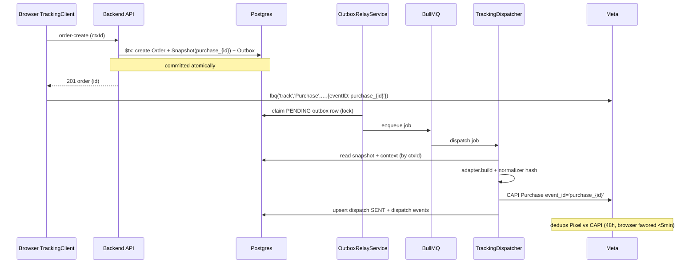
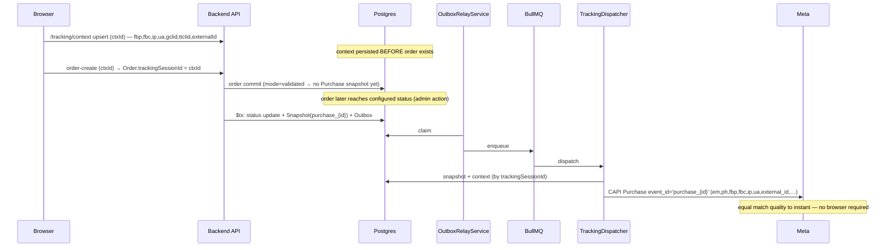
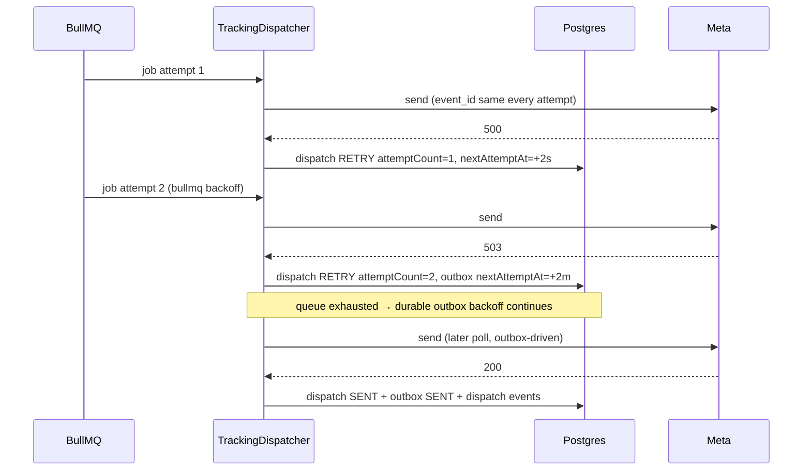
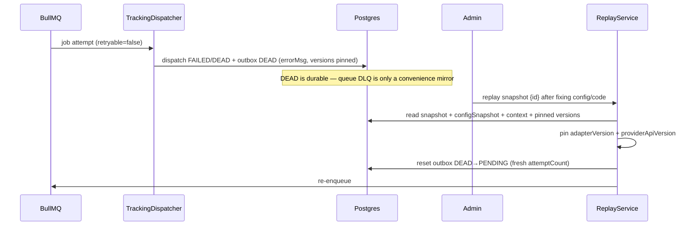

# EcoMate Meta Conversions API — Enterprise Tracking Redesign

**Status:** Approved design (pre-implementation)
**Date:** 2026-08-02
**Scope:** Backend (NestJS), Storefront (Next.js), Admin (React) — tracking pipeline only
**Approach:** Transactional Outbox + Canonical Snapshot + Provider Adapter pipeline

---

## 1. Overview

EcoMate currently fires marketing events to Meta, TikTok, GA4, and Google Ads through duplicated per-provider services with a fire-and-forget queue, no durable event log, and a Purchase double-count risk. This redesign replaces that with an **enterprise-grade, provider-agnostic tracking pipeline** built on four principles:

1. **The database is the source of truth.** Every business-critical event (Purchase, Refund, Lead) is captured as a canonical **snapshot** plus an **outbox** row *inside the same database transaction* as the business operation. BullMQ is only a delivery mechanism — a queue/Redis outage never loses an event.
2. **One canonical event, many providers.** The snapshot is a provider-agnostic business record (no hashed values, no provider field names). Provider-specific payloads are generated only by the **Dispatcher/Adapter layer**.
3. **Delayed events keep instant quality.** Browser context (`fbp`, `fbc`, `gclid`, `ttclid`, IP, UA, `external_id`) is captured *before* order creation and linked to the order, so a Purchase fired later at a configured order status has the same match keys as one fired at checkout.
4. **Everything is traceable and recoverable.** Every dispatch records correlation ids, adapter/provider versions, and every state transition; retries, dead-letter, reconciliation, idempotency, retention, anonymization, and replay are first-class parts of the design.

### Goals
- Single authoritative Purchase per order, dispatch timing configurable (instant vs. order-status "validated"), with no loss of Meta match keys or event quality in either mode.
- Provider-agnostic pipeline: adding Pinterest or any future provider requires only a new Adapter — no pipeline change.
- Hashing/normalization in exactly one shared abstraction.
- Full observability for a future Admin dashboard without an external metrics stack.

### Non-goals (out of scope for this design)
- Implementing the Admin monitoring dashboard UI in this phase (data model + KPIs are designed here; the page is built later).
- Redesigning GA4 / Google Ads / TikTok *semantics* — they are consumers of the same pipeline, but their own API requirements (e.g. GA4 `client_id`) are satisfied inside their adapters.
- Offline/POS `physical_store` dispatch flows beyond what already exists; the pipeline supports them, but web is the primary path.

---

## 2. Current Architecture (baseline)

```
Browser (storefront)
  tracking.ts  → fbq('track', E, data, {eventID})   // random eventID per event
               → POST /tracking/events (same eventId mirror)
  thank-you    → trackEvent('Purchase', …)           // random eventID
               → POST /tracking/context (fbp/fbc, keyed by orderId) — saved too late
Backend (NestJS)
  orders.service  → firePurchaseInstant (order create) / firePurchaseValidated (status change)
                    → tracking.track({eventId: 'purchase_{id}'})  // .catch() fire-and-forget
  tracking.service → enqueue to BullMQ 'tracking'
  tracking-queue.processor → map names → Promise.allSettled(Meta, TikTok, GA4)
  meta-conversions.service  // own hashing + payload + retry
  tiktok-events.service     // own hashing + payload + retry (duplicated)
  ga4-measurement.service   // env-only, client_id='ecomate-server'
  google-ads.service        // conversion on Purchase
```

### Confirmed defects
| # | Defect | Evidence |
|---|---|---|
| D1 | **Purchase double-count in `instant` mode** — browser fires Purchase with a random `eventID`; server fires a second Purchase with `purchase_{orderId}`. Different dedup keys → Meta counts two purchases. | `tracking.ts` `generateEventId()`; `orders.service.ts:3082` |
| D2 | **Server Purchase/Refund send empty `client_ip_address`/`client_user_agent`** — both are required web-event fields and match keys. | `orders.service.ts:3091-3092`, `:3137-3138` |
| D3 | **Tracking context saved too late** — browser persists `fbp/fbc` on the thank-you page, *after* the server Purchase already read it (`getContext` at order placement), so the server event typically has no `fbp/fbc`. | `ThankYouContent.tsx:116` vs `orders.service.ts:3050` |
| D4 | **No stable `external_id`** — derived per-event from `userId`/phone; not shared with the Pixel (`fbq('init', id, {external_id})`). | `meta-conversions.service.ts:93-97`; `TrackingScripts.tsx:57` |
| D5 | **Hashing/normalization duplicated** across Meta, TikTok (and partially GA4) — a rule change requires N edits. | `meta-conversions.service.ts:207-231`; `tiktok-events.service.ts:208-231` |
| D6 | **No durable event log** — `TrackingEvent` rows are never updated to `sent/failed/deduped` by the processor; failures are log-only. | `tracking-queue.processor.ts` |
| D7 | **No queue-level retry** — BullMQ job uses default `attempts`; outbox/durable retry does not exist. | `tracking-queue.service.ts:23-26` |
| D8 | **`zp` not normalized** (no dash/space strip, US first-5); non-BD phone country codes dropped. | `meta-conversions.service.ts:207-231` |
| D9 | **Coverage gaps** — `AddPaymentInfo`, `Search`, `CompleteRegistration` never fire at all (neither Pixel nor CAPI). (`PageView` fires via Pixel + analytics only — acceptable; CAPI PageView is excluded by design.) | storefront grep |
| D10 | **`test_event_code` unguarded** — applied whenever the setting exists, even in production. | `meta-conversions.service.ts:131-133` |

---

## 3. Target Architecture

### 3.1 Principles
- **Queue = delivery mechanism; DB (outbox) = source of truth.** The dispatcher reads *only* the outbox.
- **Canonical snapshot is the single business record**; providers are projections of it.
- **Provider independence**: one provider failing never blocks others; each provider's state is tracked independently.
- **Write-once context**: static identifiers are first-seen-wins; rotating identifiers refresh but are never cleared.

### 3.2 Component diagram

```
┌──────────── Browser (storefront) ─────────────┐      ┌────────────────── backend ──────────────────┐
│ TrackingClient                               │      │                                              │
│ • ctxId (localStorage, stable per journey)   │      │ Business layer (orders, refunds, leads)      │
│ • reads _fbp/_fbc/_ga/gclid/ttclid + URL     │      │  ┌─────────────────────────────────────────┐  │
│ • fbq('track', E, {eventID})                 │      │  │ prisma.$transaction:                    │  │
│ • POST /tracking/context (upsert ctxId)      │─────▶│  │  business mutation                      │  │
│ • POST /tracking/events (mirror, same id)    │─────▶│  │  + TrackingSnapshot insert             │  │
│ • order-create carries ctxId                 │─────▶│  │  + TrackingOutbox insert               │  │
└──────────────────────────────────────────────┘      │  └─────────────────────────────────────────┘  │
                                                     │              │                                  │
                                                     │              ▼                                  │
                                                     │  OutboxRelayService (claim + enqueue)           │
                                                     │              │                                  │
                                                     │              ▼                                  │
                                                     │  BullMQ 'tracking' (delivery only)              │
                                                     │              │                                  │
                                                     │              ▼                                  │
                                                     │  TrackingDispatcher                            │
                                                     │   snapshot + context ──▶ Adapter registry       │
                                                     │   (Meta/TikTok/GA4/GoogleAds/…)                │
                                                     │   └─ TrackingNormalizer (SHA-256, one place)   │
                                                     │   └─ TrackingDispatch (per-provider log)       │
                                                     │   └─ TrackingDispatchEvent (state transitions)  │
                                                     │  DLQ ──▶ ReconcilerService ──▶ re-enqueue      │
                                                     │  ReplayService (version-pinned re-dispatch)    │
                                                     └───────────────────────────────────────────────┘
```

---

## 4. Core Components

### 4.1 TrackingContext (browser session context — provider-agnostic)

Captures everything needed to match a user across providers, independent of any single provider.

| Field | Type | Notes |
|---|---|---|
| `id` | uuid | PK |
| `ctxId` | string, unique | Stable journey id generated by the browser (`localStorage`), passed on every tracking call and on order-create |
| `externalId` | string | Server-generated stable uuid per customer/journey — Meta's recommended long-term match key, shared across **all** providers |
| `ip` / `userAgent` | string | Added by the backend from the request (never trusted from the browser) |
| `url` / `referrer` | string | Page context at last observation |
| `identifiers` | Json | Provider-namespaced raw identifiers: `{"meta":{"fbp","fbc","fbclid"},"tiktok":{"ttclid","_ttp"},"google":{"gaClientId","gclid"},"pinterest":{…}}` |
| `firstSeenAt` / `lastSeenAt` | timestamp | Provenance for every field (see enrichment) |
| `createdAt` / `updatedAt` | timestamp | |

**Provider-agnostic design:** a new provider needs **no schema change** — it is just new keys under `identifiers`. The backend stores whatever cookie/URL identifiers the browser observes; providers are namespaces, not columns. (Refinement: cross-provider without redesign.)

**Enrichment rules (incremental):**
- **Static identifiers** (`externalId`, email, phone): **first non-empty value wins**; later requests fill only missing fields, never overwrite.
- **Rotating identifiers** (`fbp`, `fbc`, `gclid`, `ttclid`, `_ga`): replace when a **newer valid value** arrives; **never clear to null** — a cookie-loss page load must not destroy the value a delayed event depends on.
- Every identifier stores `firstSeenAt`/`lastSeenAt`.

**Order linkage:** `Order.trackingSessionId = ctxId` (set at order creation from the incoming `ctxId`). The dispatcher resolves context via snapshot → `ctxId`. This is the mechanism that makes **delayed Purchase quality identical to instant**.

### 4.2 TrackingSnapshot (canonical business event)

The immutable, provider-agnostic record of *what happened*. **Never** contains provider payloads, hashed values, or provider-specific parameter names.

| Field | Type | Notes |
|---|---|---|
| `id` | uuid | PK |
| `eventId` | string, unique | Dedup key: `purchase_{orderId}` / `refund_{orderId}` / `lead_{id}` / client-generated id for browser events |
| `eventType` | string | `Purchase`, `Refund`, `AddToCart`, `InitiateCheckout`, `AddPaymentInfo`, `ViewContent`, `Search`, `CompleteRegistration`, `Lead`, `PageView` |
| `orderId` / `ctxId` | string? | Linkage for dispatch + dashboard |
| `eventTime` | int | Unix seconds at business time (order createdAt / status-change time) — never dispatch time |
| `actionSource` | string | `website` / `physical_store` / … |
| `schemaVersion` | int | Canonical payload schema version; bump only on breaking shape changes |
| `payload` | Json | Canonical business data: order totals, items (`id`, `quantity`, `item_price`), customer (email, phone, names — **raw, unhashed**), etc. |
| `createdAt` | timestamp | |

Hashing happens **only** in the adapter/normalizer path, never at capture.

### 4.3 TrackingOutbox (source of truth)

| Field | Type | Notes |
|---|---|---|
| `id` | uuid | PK |
| `snapshotId` | string, unique → snapshot | One outbox row per snapshot |
| `configSnapshot` | Json | Tracking config active at business time: enabled providers, purchase mode, validated status, success policy, normalizer version |
| `status` | enum | `PENDING` → `CLAIMED` → `SENT` \| `FAILED` → `DEAD` |
| `attemptCount` | int | Durable retry counter |
| `nextAttemptAt` | timestamp | Backoff schedule |
| `lockedAt` / `lockedBy` | timestamp / string | Relay claim guard |
| `lastError` | string? | For dashboard |
| `createdAt` / `publishedAt` / `dispatchedAt` | timestamp | |

Claim query: atomic `updateMany … WHERE status='PENDING' AND nextAttemptAt<=now AND lockedAt IS NULL` → `CLAIMED`.

### 4.4 TrackingDispatch + TrackingDispatchEvent (per-provider state + observability)

**TrackingDispatch** — exactly one row per (snapshot, provider); idempotency guard.

| Field | Type | Notes |
|---|---|---|
| `id` | uuid | PK |
| `snapshotId` | string | Correlation root (= `correlationId`) |
| `eventId` / `orderId` / `ctxId` | string? | Denormalized from snapshot for observability |
| `provider` | string | `meta` / `tiktok` / `ga4` / `google_ads` / … |
| `status` | enum | `PENDING` → `SENDING` → `SENT` \| `RETRY` → `SENT` \| `FAILED` → `DEAD`, plus `DEDUPED`, `SKIPPED` |
| `providerEventId` | string? | Provider-side dedup id (Meta `event_id`, TikTok `event_id`) — same value on every retry |
| `httpStatus` / `responseBody` / `errorMsg` | int / string? | Sanitized (PII stripped/truncated) |
| `attemptCount` | int | |
| `adapterVersion` / `providerApiVersion` / `payloadVersion` | int / string | Pinned at send time — enables version-accurate replay and audit |
| `queueJobId` | string? | For cross-system tracing |
| `createdAt` / `updatedAt` | timestamp | |

`@@unique([snapshotId, provider])` — a retry **upserts** this row (`attemptCount++`), never creates a second row.

**TrackingDispatchEvent** — append-only transition log, the raw material for the Admin dashboard timeline: `snapshotId, eventId, orderId, ctxId, provider?, queueJobId?, fromStatus, toStatus, attempt, message?, createdAt`.

### 4.5 TrackingNormalizer (single hashing/normalization abstraction)

One class, injected into every adapter. Owns all SHA-256 hashing and normalization:
`hashEmail`, `hashPhone(phone, country)` (adds `880`/`1`), `hashName`, `hashCity/State/Zip/Country`, `hashExternalId`, `isSyntheticEmail`, `splitName`, zip de-dash/US-first-5, gender/dob normalization.

- Exposes both **raw-normalized** and **hashed** variants; adapters pick what their provider requires (e.g. GA4 takes `client_id` raw, Meta takes SHA-256 `em`).
- **No adapter implements hashing or normalization.** A provider rule change = edit one file. (Meta best practice: lowercase+trim before SHA-256, phone keeps country code, etc.)

### 4.6 TrackingProviderAdapter + registry

```ts
interface TrackingProviderAdapter {
  readonly provider: string;                 // 'meta' | 'tiktok' | 'ga4' | 'google_ads' | 'pinterest' | …
  readonly version: number;                  // adapterVersion
  readonly providerApiVersion: string;       // e.g. 'v22.0' (Meta), 'v1.3' (TikTok)
  supports(eventType: string): boolean;      // which snapshot types this provider consumes
  build(snapshot, ctx, normalizer): ProviderPayload | null;   // → canonical + hashed provider fields
  send(payload, cfg): Promise<DispatchResult>;
}
interface DispatchResult {
  ok: boolean;
  retryable: boolean;                        // 4xx → false; 5xx/429/timeout → true
  providerEventId?: string;
  httpStatus?: number;
  rawResponse?: string;
}
```

- The registry is a `Map<(provider, version), TrackingProviderAdapter>` populated at module bootstrap. **Old adapter versions stay registered (frozen)** so replay can pin the exact version that produced a historical payload; live dispatch always uses the latest.
- **Adding a provider = adding one Adapter class + one config block.** The pipeline, outbox, queue, retry, monitoring never change. (Refinement: provider-agnostic core.)

### 4.7 TrackingDispatcher

- Sole consumer of the outbox (via queue jobs). For each snapshot: load snapshot + linked `TrackingContext`, iterate the **enabled** providers from `configSnapshot`, and run each adapter **independently** (`Promise.allSettled`) — a Meta failure never blocks TikTok/GA4/Google Ads.
- Each provider advances its own `TrackingDispatch`; the outbox reaches terminal state by a **configurable success policy** in `configSnapshot`: `ALL_SENT` (default) / `ANY_SENT` / `N_SENT`. Failed providers keep retrying on their own schedule without re-triggering already-`SENT` ones (idempotent upsert makes this safe).
- **Payloads are ephemeral** — built in the send path, never persisted (only sanitized status/response is stored).

### 4.8 OutboxRelayService

- Interval poll (~1s): atomically claim N `PENDING` rows (lock + `CLAIMED`), enqueue one BullMQ job per row (job `jobId = outboxId`, payload carries `{snapshotId, eventId, orderId, ctxId}`).
- If enqueue fails, **release the lock** (back to `PENDING`) → next poll retries. No event is lost while Redis is down; the row simply waits. (Refinement: DB is truth, queue is delivery.)

### 4.9 ReconcilerService (self-healing)

Scheduled job that repairs stuck states deterministically:
- `PENDING` older than threshold → re-claim (relay missed it).
- `CLAIMED` with no dispatch progress > X min → reset to `PENDING` (worker died mid-flight).
- `SENDING` dispatch hung > X min → mark retryable → retry.

### 4.10 ReplayService

- Reads a `DEAD`/old snapshot + its `configSnapshot` + pinned `adapterVersion`/`providerApiVersion`/`schemaVersion` from the dispatch record.
- Re-runs through the registry, **pinning the recorded adapter version** if still registered (else current version with an explicit version-mismatch warning).
- Resets outbox `DEAD → PENDING` with a fresh `attemptCount`, re-enqueues. This is what makes a 2-year-old Purchase replayable after Meta moves v22 → v23.

### 4.11 TrackingSettingsService

Central config source: system_settings keys + env fallback (same pattern as today's `tracking_meta_*`). Keys: enabled flags, pixel ids/tokens, purchase mode, validated status, success policy, test-event codes, retention windows. Adapters receive their config through this service; values are snapshotted into `configSnapshot` at capture time.

- **Test-event codes are gated:** a `test_event_code` is honored only when the provider's explicit test-mode flag is set — a leftover value can never leak into production traffic (fixes D10).

### 4.12 TrackingClient (browser)

- On load: get-or-create `ctxId` (localStorage), read cookies `_fbp`, `_fbc`, `_ga`, `_ttp`, and URL params `fbclid`, `gclid`, `ttclid`; POST `/tracking/context` (upsert by `ctxId`, throttled).
- Every `trackEvent`: fire the Pixel `fbq('track', E, data, {eventID})` **and** POST `/tracking/events` with the **same** `eventId` + `ctxId` (Pixel↔CAPI parity + provider dedup).
- Purchase: pass the **deterministic** `eventId = purchase_{orderId}` (from the order response) instead of a random id — fixes D1. In **validated** mode the browser does **not** fire a Purchase at all.
- Order-create includes `ctxId` → backend sets `Order.trackingSessionId`.

---

## 5. Capture Paths

Two ways a snapshot enters the pipeline; both funnel to snapshot + outbox → dispatcher.

1. **Server-authoritative (transactional, for business-critical events):** `Purchase`, `Refund`, `Lead`. Written inside the **same `prisma.$transaction`** as the business mutation:
   - order creation → instant Purchase snapshot (or no snapshot if mode = validated)
   - order status change → validated Purchase snapshot (when status matches `validated_status`) / Refund snapshot (cancelled/returned)
   - lead creation → Lead snapshot
   This replaces today's fire-and-forget `.catch()` calls (`orders.service.ts:1292`, `:1827`). If the order commits, the event is guaranteed captured.
2. **Browser-originated (Pixel parity, for client events):** `AddToCart`, `InitiateCheckout`, `AddPaymentInfo`, `ViewContent`, `Search`, `CompleteRegistration`. The browser POSTs `/tracking/events`; the handler creates snapshot + outbox (its own transaction). Needed for the ≥75% Pixel↔CAPI coverage target; no server business mutation exists for these. **`PageView` is excluded from CAPI dispatch** (Pixel fires it; page-view analytics keep the existing buffer path) — Meta treats CAPI PageView as low-value, so it is not part of the parity set.

**Important:** `/tracking/events` is now a *capture* endpoint (writes snapshot+outbox), not a direct send. The dispatcher handles all delivery.

---

## 6. Dispatch Semantics — Single Authoritative Purchase

Per approved model, a Purchase business event exists **once** per order; only *timing* is configurable:

| Mode | Browser Pixel | Server CAPI | When |
|---|---|---|---|
| **Instant** (default) | Fires `fbq('track','Purchase',…,{eventID:'purchase_{orderId}'})` on thank-you | Captured transactionally at order create, dispatched ~seconds later, `event_id='purchase_{orderId}'` | Order placed |
| **Validated** | **No** Purchase dispatch | Captured transactionally when the order reaches the configured `validated_status` | Status change |

- **Instant:** Pixel + CAPI share `event_id` → Meta dedups within 48h (favors browser event within 5 min). Fixes D1.
- **Validated:** no browser event; CAPI uses the **persisted context** (`fbp`, `fbc`, `ip`, `ua`, `external_id`, …) via `Order.trackingSessionId` → **equal match quality to instant** (fixes D2/D3/D4). Event quality no longer depends on whether the user's browser is still open.

---

## 7. Queue Lifecycle, Retry, DLQ, Idempotency, Reconciliation

### 7.1 State machines (monitoring-first)

**Outbox (event-level, source of truth):**
```
PENDING ──► CLAIMED ──► SENT            (success policy met)
                    └──► FAILED ──► DEAD  (retries exhausted / permanent)
```

**TrackingDispatch (per-provider):**
```
PENDING ──► SENDING ──► SENT
                    └──► RETRY ──► SENDING ──► … ──► SENT | FAILED ──► DEAD
                        (SKIPPED)   (DEDUPED)
```
Every transition appends a `TrackingDispatchEvent`.

### 7.2 Retry (two layers, no conflict)
1. **Queue layer (transport):** BullMQ `attempts: 3`, exponential backoff `2000ms`. `removeOnComplete: 100`, `removeOnFail: 50`.
2. **Outbox layer (durable):** `attemptCount` + `nextAttemptAt` with exponential backoff (1m → 10m → 1h → 6h → 24h; max 5 → `DEAD`). Survives a full queue/Redis outage.
   - Adapter `retryable=true` (5xx / 429 / timeout / network) → retry.
   - Adapter `retryable=false` (4xx / validation) → permanent `FAILED`/`DEAD` with `errorMsg` — surfaced in monitoring as a code/config bug; no point re-sending a bad payload.
   - **Retries reuse the same `providerEventId`** so provider-side dedup absorbs duplicate sends.

### 7.3 Dead-letter
- Exhausted jobs mirror to a `tracking-dlq` BullMQ queue for ops visibility, but the **durable DEAD record is the DB** — the queue DLQ is a convenience, never the source of truth.

### 7.4 Idempotency
- `TrackingSnapshot.eventId UNIQUE` + `TrackingOutbox.snapshotId UNIQUE` → capture-once (inside the business transaction).
- `TrackingDispatch @@unique([snapshotId, provider])` → one dispatch row per provider; retries upsert.
- Provider keys unchanged on retry (Meta/TikTok `event_id`).

### 7.5 Reconciliation
See §4.9 — every stuck state has a deterministic repair path because the DB is the truth.

---

## 8. Versioning & Configuration Snapshotting

| Version | Stored | Meaning |
|---|---|---|
| `schemaVersion` | snapshot | Canonical payload schema version; bump only on breaking `payload` shape change |
| `adapterVersion` | dispatch | Which adapter code produced the payload |
| `providerApiVersion` | dispatch | Provider API version used (e.g. Meta `v22.0`) |
| `payloadVersion` | dispatch | Adapter `build()` output shape version |

- **`configSnapshot`** (outbox) captures the tracking config active at business time: enabled providers, purchase mode, validated status, success policy, normalizer version.
- **Defined behavior:** an event dispatches according to the rules in its **own** `configSnapshot`, not current settings. **Only exception:** blocking/consent/security changes always apply (a now-forbidden event cannot replay).
- **Replay** (§4.10) uses the pinned versions → a 2-year-old Purchase remains reproducible/auditable after Meta API version bumps.

---

## 9. Deduplication Strategy

Layered, app-level + provider-level:
1. **Capture:** `eventId UNIQUE` + `snapshotId UNIQUE` → capture-once.
2. **Per-provider:** `@@unique([snapshotId, provider])` → one dispatch row; retries upsert.
3. **Provider pass-through:** Meta/TikTok `event_id` = the same dedup key, reused on every retry.
4. **Instant Purchase:** Pixel `eventID` = CAPI `event_id` = `purchase_{orderId}` → Meta dedups.
5. **App-side `DEDUPED`:** a validated Purchase re-triggered for an already-sent order is marked `DEDUPED`, not re-sent.
6. **Coverage target ≥75%** of unique Pixel events also arriving via CAPI; dashboard tracks dedup key usage (`event_id`/`external_id`/`fbp`) and overlap.

---

## 10. Event Match Quality (EMQ) Optimization

- **Stable `external_id`** on every context, shared across all providers and events → long-lived match key (Meta recommended).
- **Full key set from persisted context** for delayed events: `em`, `ph` (country code), `fn/ln`, `ct/st/zp/country`, `fbp`, `fbc`, `client_ip_address`, `client_user_agent`.
- **Enrichment rules** (§4.1) guarantee the keys a delayed event needs survive the journey.
- **Normalizer guards:** always include `em` or `ph` (avoids Graph API v13.0 invalid-combination rejection); synthetic-email filter retained; zip normalized.
- **Target:** EMQ ≥ 6.0 for web events; dashboard shows an estimated match-quality proxy (key-coverage score per event type).

---

## 11. Data Freshness

- `eventTime` = business time (order createdAt / status-change time), never dispatch time.
- Relay poll ~1s + ms queue latency → near-real-time; a validated Purchase dispatches within seconds of the status transition.
- `event_time` ≤ 7 days guard in adapters (older → dead-lettered, per Meta's whole-request rejection).
- Request timeout 1500ms, typical <600ms; single-event requests (batch=1).
- Dashboard freshness metric = capture → dispatch delay per event type.

---

## 12. Privacy & Compliance

- **Raw data is bounded and categorized:**
  - *Session identifiers* (`ip`, `userAgent`, `fbc`, `fbp`, `gaClientId`, `ttclid`, `gclid`, url/referrer) live **only** in `TrackingContext`.
  - *Canonical customer contact fields* (email, phone, name, address — raw, needed for hashing at dispatch) live **only** in `TrackingSnapshot.payload`.
  - Both carry the same bounded retention (90 days) and anonymization (below).
- **Hashed provider payloads are ephemeral** — built at dispatch, sent, **not persisted**. `TrackingDispatch` stores only sanitized status/response (PII stripped/truncated).
- **Clear raw↔hashed separation:** raw values exist only in context/snapshot; SHA-256 output exists only transiently in the adapter send path. The two never co-mingle in storage.
- **Retention policy** (scheduled cleanup job):
  | Data | Retention | Action |
  |---|---|---|
  | `TrackingContext` | 90 days | Anonymize (null `identifiers`, `ip`, `userAgent`, `url`, `referrer`; keep `ctxId`/`externalId`/timestamps) |
  | `TrackingSnapshot.payload` | 90 days | Null `payload`; keep `eventId`/`eventType`/`orderId`/`eventTime` |
  | `TrackingOutbox` | 30 days after terminal | Purge |
  | `TrackingDispatch` / `TrackingDispatchEvent` | 1 year | Purge |
- **Deletion workflow:** admin endpoint deletes context by `externalId`/customer and anonymizes snapshot references (keeps dedup keys, removes PII).
- **Consent hook:** a config flag gates capture; `opt_out` respected at dispatch.

---

## 13. Transaction Boundaries & Failure Scenarios

### 13.1 Transaction scopes
| Operation | In DB transaction | Outside (async) |
|---|---|---|
| Order creation | order + snapshot + outbox insert | dispatch |
| Order status change | order + snapshot + outbox insert | dispatch |
| Refund creation | refund + snapshot + outbox | dispatch |
| Lead creation | lead + snapshot + outbox | dispatch |
| `/tracking/context` upsert | single-row upsert (own txn) | — |
| `/tracking/events` (browser) | snapshot + outbox insert (own txn) | dispatch |
| Relay claim | atomic `updateMany` lock (own txn) | enqueue |
| Dispatcher | per-provider dispatch upsert (own txn) | network send |

### 13.2 Failure matrix
| Failure | Detection | Recovery |
|---|---|---|
| Redis/queue down at enqueue | relay releases lock | next poll re-claims (DB is truth) |
| Queue job lost | outbox still `CLAIMED` > T | Reconciler resets → re-claim |
| Worker crash mid-dispatch | dispatch `SENDING` > T | Reconciler marks retryable |
| DB down at capture | business txn fails | business operation fails (correct — no phantom event) |
| Provider 5xx / 429 / timeout | `retryable=true` | queue retry → outbox backoff → Sent |
| Provider 4xx | `retryable=false` | `FAILED`/`DEAD` + surfaced (code/config bug) |
| Meta API version bump | `providerApiVersion` pinned per dispatch | Replay uses recorded version |
| Config changed mid-lifecycle | `configSnapshot` | event follows capture-time rules (§8) |

---

## 14. Monitoring Dashboard (Admin — data model designed now, UI built later)

- **Page:** `/settings/tracking/monitoring`.
- **KPIs (pure Prisma over the new tables + BullMQ job counts — no external metrics stack):**
  - Volume by event type (snapshot count by `eventType`, time-bucketed).
  - Per-provider dispatch funnel: `Pending → Sending → Sent / Retry / Failed / Dead`.
  - DLQ depth (BullMQ) + durable `DEAD` counts (DB).
  - Retry histogram (`attemptCount` distribution).
  - Dedup key usage (`event_id`/`external_id`/`fbp`) + overlap; coverage ratio vs Pixel.
  - Estimated match-quality proxy per event type.
  - Freshness: average capture → dispatch delay.
  - Top failure reasons (`errorMsg` aggregation).
- **Per-event timeline:** search by `eventId`/`orderId`/`ctxId` → full lifecycle from capture → relay → each provider attempt → terminal, from `TrackingDispatchEvent` joined on correlation ids.

---

## 15. Database Schema (Prisma)

```prisma
model TrackingContext {
  id           String   @id @default(uuid())
  ctxId        String   @unique
  externalId   String   @default(uuid())   // server-generated stable match id (never from browser)
  ip           String?
  userAgent    String?
  url          String?
  referrer     String?
  identifiers  Json     @default("{}")   // { "meta": {fbp,fbc}, "tiktok": {ttclid}, "google": {gaClientId,gclid}, ... }
  firstSeenAt  DateTime @default(now())
  lastSeenAt   DateTime @updatedAt
  createdAt    DateTime @default(now())
  updatedAt    DateTime @updatedAt
}
// Order gains: trackingSessionId String? (== ctxId)  @@index([trackingSessionId])

model TrackingSnapshot {
  id            String   @id @default(uuid())
  eventId       String   @unique
  eventType     String
  orderId       String?
  ctxId         String?
  eventTime     Int
  actionSource  String?
  schemaVersion Int      @default(1)
  payload       Json
  createdAt     DateTime @default(now())

  @@index([orderId])
  @@index([eventType, createdAt])
}

model TrackingOutbox {
  id             String   @id @default(uuid())
  snapshotId     String   @unique
  configSnapshot Json     @default("{}")
  status         String   @default("PENDING")  // PENDING | CLAIMED | SENT | FAILED | DEAD
  attemptCount   Int      @default(0)
  nextAttemptAt  DateTime @default(now())
  lockedAt       DateTime?
  lockedBy       String?
  lastError      String?
  createdAt      DateTime @default(now())
  publishedAt    DateTime?
  dispatchedAt   DateTime?

  @@index([status, nextAttemptAt])
}

model TrackingDispatch {
  id                 String   @id @default(uuid())
  snapshotId         String
  eventId            String
  orderId            String?
  ctxId              String?
  queueJobId         String?
  provider           String
  status             String   @default("PENDING") // PENDING|SENDING|SENT|RETRY|FAILED|DEDUPED|SKIPPED|DEAD
  providerEventId    String?
  httpStatus         Int?
  responseBody       String?
  errorMsg           String?
  attemptCount       Int      @default(0)
  adapterVersion     Int
  providerApiVersion String
  payloadVersion     Int
  createdAt          DateTime @default(now())
  updatedAt          DateTime @updatedAt

  @@unique([snapshotId, provider])
  @@index([provider, status, createdAt])
}

model TrackingDispatchEvent {
  id           String   @id @default(uuid())
  snapshotId   String
  eventId      String
  orderId      String?
  ctxId        String?
  provider     String?
  queueJobId   String?
  fromStatus   String?
  toStatus     String
  attempt      Int?
  message      String?
  createdAt    DateTime @default(now())

  @@index([snapshotId, createdAt])
  @@index([provider, toStatus, createdAt])
}
```

Notes:
- The existing `TrackingEvent` table is **retired** by this design (context moves to `TrackingContext`; lead dedup moves to a `TrackingSnapshot` lookup). It is removed in Phase 3 after data migration.
- Context→order linkage is via `Order.trackingSessionId` (== `ctxId`); `TrackingContext` has no `orderId` column by default. If a direct context→order query is needed, add `orderId` back as a convenience column with `@@index([orderId])`. Decision deferred to Phase 0 — the schema above is the default.
- All status enums are stored as strings for forward compatibility; validated with a shared constant/enum in code.

---

## 16. Sequence Diagrams

### 16.1 Instant Purchase (Pixel + CAPI, shared `event_id` → Meta dedups)


### 16.2 Delayed Purchase (validated status — persisted context, equal quality)


### 16.3 Retry (5xx → queue → outbox backoff → sent)


### 16.4 Dead-letter + replay


---

## 17. Extensibility — Adding a Provider

To add, e.g., **Pinterest**:
1. Implement `TrackingProviderAdapter` (`provider: 'pinterest'`, versions, `build`, `send`).
2. Register it in the adapter registry + add a `TrackingSettingsService` config block (`tracking_pinterest_*`).
3. Add Pinterest identifiers under `TrackingContext.identifiers.pinterest` (browser client + context upsert).

No schema, outbox, queue, dispatcher, or monitoring changes. The same Purchase/Refund/AddToCart snapshots are consumed via `supports(eventType)`.

---

## 18. Implementation Roadmap

| Phase | Scope | Apps | Exit criteria |
|---|---|---|---|
| 0 | Prisma schema (`TrackingContext`/`Snapshot`/`Outbox`/`Dispatch`/`DispatchEvent`), `Order.trackingSessionId`, settings config, retire `TrackingEvent` | backend | migration + build green |
| 1 | `TrackingContext` capture: `TrackingClient` (ctxId, cookies, URL params), `/tracking/context` upsert + enrichment, order linkage | storefront, backend | context persisted before order; delayed events read it |
| 2 | `TrackingNormalizer` + `TrackingProviderAdapter` interface + Meta/TikTok/GA4/GoogleAds adapters + registry | backend | single hashing path; per-provider dispatch rows |
| 3 | Snapshot+Outbox capture inside orders/leads transactions; `OutboxRelayService` + queue wiring; retire `TrackingEvent` usage | backend | Purchase/Refund/Lead transactionally captured |
| 4 | `TrackingDispatcher` (provider independence, success policy) + `TrackingDispatchEvent` log + browser `/tracking/events` capture path | backend | provider independence verified |
| 5 | Retry/backoff, DLQ, `ReconcilerService`, versioning (`schemaVersion`/`adapterVersion`/`providerApiVersion`/`configSnapshot`), `ReplayService` | backend | failure-matrix scenarios tested |
| 6 | Monitoring dashboard (KPIs + per-event timeline) | admin | dashboard live from Prisma data |
| 7 | Retention/anonymization/deletion jobs; load-test relay+dispatcher; soak | backend | policies + replay verified |

Cross-cutting every phase: Jest TDD for behavior changes, `npm run build` for affected apps, schema+migration committed atomically (AGENTS.md), preserve business-integrity rules (transactions, `managedStockQuantity`, order/refund state transitions untouched — tracking is additive).

---

## 19. Glossary

- **ctxId** — browser-generated stable journey id (localStorage).
- **correlationId** — trace root; equals `snapshotId`.
- **eventId** — dedup key shared across providers (`purchase_{orderId}`, …).
- **Snapshot** — canonical business event (raw, provider-agnostic).
- **Outbox** — durable capture row; source of truth for dispatch.
- **Dispatch** — per-provider send record.
- **Normalizer** — the single hashing/normalization abstraction.
- **Instant / Validated** — Purchase dispatch timing: at order placement vs. at configured order status.

## 20. Open Decisions (resolved by default; revisit only if needed)

1. `TrackingContext.orderId` convenience column: default is **no** (join via `Order.trackingSessionId`). Add in Phase 0 if dashboard queries justify it.
2. Success policy default: **`ALL_SENT`** for enabled critical providers; `ANY_SENT` available for best-effort providers.
3. Browser context POST throttling: on navigation + on each tracked event (≤ a few per page); refine with real traffic in Phase 1.
